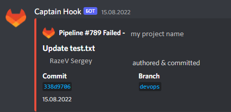
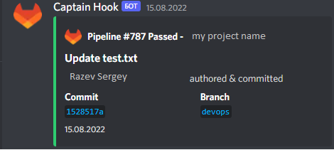

# Description Pipline

If there are changes in the backend folder, then the backend build pipeline is automatically launched. On the frontend, the situation is similar, if changes have come to the frontend folder, then the assembly on the frontend is automatically started.

After the build, a link to the project appears in the demoployments -> Environments section

See demployments -> Environments

Depending on how the pipeline was executed, a message will be sent to the discord: failed or successful

If failed to

If successful to

